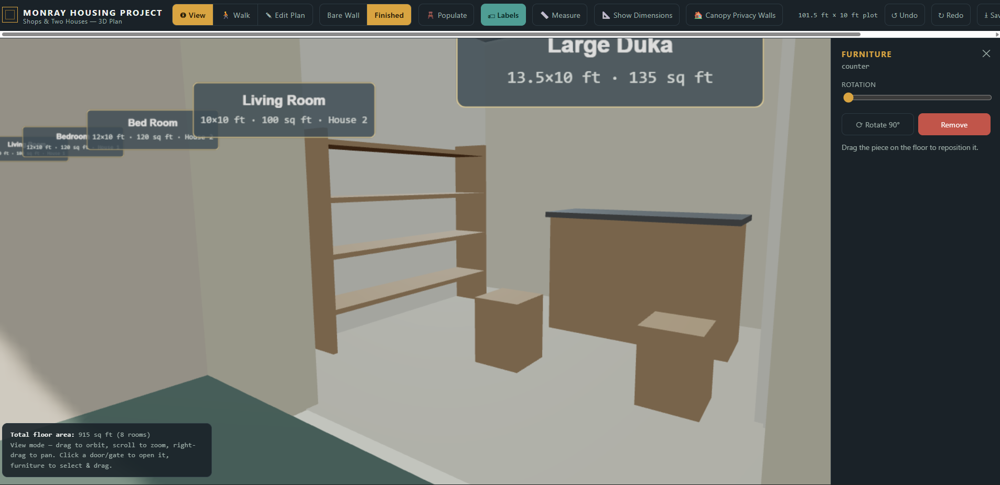

# 🏗️ MonRay Plaza 3D

**An interactive, procedural 3D architectural visualization built entirely in a single HTML file.**

---

## ✨ Overview

**MonRay Plaza 3D** is a lightweight, ultra-responsive architectural visualization tool. Designed to bring 2D floor plans to life, it dynamically generates a fully interactive 3D model of a mixed-use residential and commercial estate. 

Users can seamlessly orbit the exterior, explore realistic interior spaces in first-person, open doors, toggle structural views, and automatically populate rooms with dimensionally-accurate furniture—all without a backend server or heavy assets.

---

## 🚀 Features

* 🏘️ **Mixed-Use Zoning:** Seamlessly integrates residential units (House 1 & 2) and commercial spaces (Dukas) within a continuous architectural footprint.
* 🚶 **First-Person Walk Mode:** Experience the scale of the building using intuitive joystick (mobile) or WASD (desktop) controls with physical collision detection.
* 🪑 **Procedural Population:** Instantly furnish rooms with scaled-down, realistic furniture specific to each room type (bedrooms, living rooms, shops, and bathrooms).
* 🧱 **X-Ray & Bare Wall Modes:** Strip back the finishes and roof to inspect the raw structural floor plan and spatial flow.
* 📏 **Real-Time Measurement:** Integrated tape measure tool to verify distances and architectural dimensions interactively in 3D space.
* 📱 **Mobile Optimized:** Fluid frame rates, dynamic pixel-ratio scaling, and bespoke touch controls ensure a premium experience on any device.

---

## 📸 Gallery

  <table>
    <tr>
      <td align="center">
        
         <i>Exterior Orbit View</i>
      </td>
      <td align="center">
        
         <i>First-Person Walk Mode</i>
      </td>
    </tr>
    <tr>
      <td align="center">
        
         <i>Bare Wall / Structural View</i>
      </td>
      <td align="center">
        
         <i>Procedurally Furnished Interiors</i>
      </td>
    </tr>
  </table>

---

## 🛠️ Technical Architecture

This project is a masterclass in monolithic web design:
- **Zero Build Tools:** No Webpack, Vite, or Node required. It runs natively in any browser.
- **Procedural Geometry:** Uses `THREE.ExtrudeGeometry` and custom 2D pathing to cut mathematically perfect doorways and windows dynamically on initialization.
- **State-Driven UI:** Custom UI overlays built with Vanilla JS DOM manipulation overlaying the WebGL canvas.

### 📐 Project Zoning (Left to Right)
1. **House 1:** Living Room & Bedroom (with private bathroom).
2. **House 2:** Bedroom (with private bathroom) & Living Room.
3. **Large Duka:** Commercial shop featuring a rear-access public toilet.
4. **Duka 3, 2, & 1:** Commercial storefronts with roll-up gates.

---

## 🎮 Controls

### Desktop
- **Orbit Mode:** Left-Click & Drag to rotate, Scroll to zoom, Right-Click to pan.
- **Walk Mode:** `W`/`A`/`S`/`D` to move, Mouse to look around. Press `E` to interact with doors/gates.

### Mobile
- **Orbit Mode:** One-finger swipe to rotate, Pinch to zoom, Two-finger drag to pan.
- **Walk Mode:** Left-side virtual joystick to move, Right-side drag to look around. Tap doors to interact.

---

## 🚀 Getting Started

Simply double-click the HTML file (`monray (1).html` / `index.html`) to open it in any modern web browser. No installation, server, or dependencies required!

---

  
Built with ❤️ using Three.js

